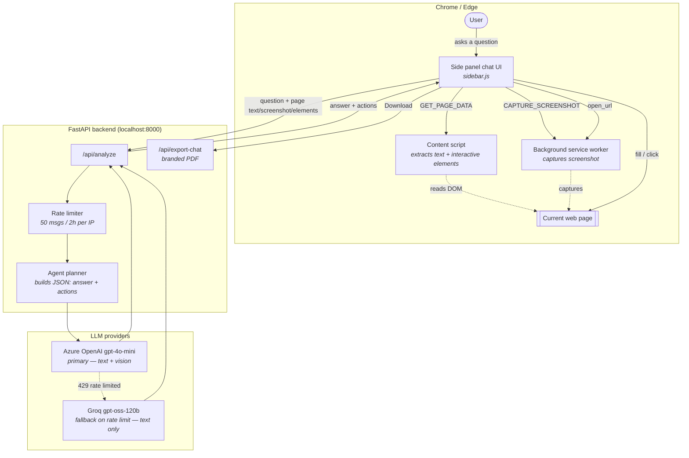

# ActPilot

An AI browser agent: a Chrome/Edge extension that reads the page you're on — text, a screenshot,
and its fillable/clickable elements — and can both **answer questions about it** (including
rendering charts/graphs when the data calls for one) and **act on it** (fill fields, click things,
search the web and open results) from a chat side panel.

See [docs/PRODUCT_VISION.md](docs/PRODUCT_VISION.md) for the full product concept and roadmap.

## Architecture



**The loop, in words:** the side panel gathers page text, a screenshot, and a list of fillable/
clickable elements (each tagged with a stable id); the backend checks the per-IP rate limit, asks
the LLM for a single JSON reply containing an `answer` and an optional list of `actions`
(`fill`/`click`/`open_url`, referencing elements only by the ids it was given); the extension then
executes those actions for real against the page and reports back what it did.

## Backend setup

```bash
cd backend
python -m venv .venv
.venv\Scripts\activate        # Windows
# source .venv/bin/activate   # macOS/Linux

pip install -r requirements.txt
copy .env.example .env        # Windows: copy, macOS/Linux: cp
```

Edit `.env`:
- `AZURE_LLM_*` — your Azure OpenAI chat deployment (primary, vision-capable)
- `GROQ_API_KEY` / `GROQ_LLM_MODEL` — fallback, used automatically only when Azure returns a
  rate-limit error

Run it:

```bash
uvicorn app.main:app --reload --port 8000
```

Check it's up: `GET http://localhost:8000/api/health` → `{"status": "ok"}`

## Extension setup

No build step needed — it's plain JS/HTML/CSS.

1. Open `chrome://extensions` (or `edge://extensions`)
2. Enable **Developer mode**
3. Click **Load unpacked** and select the `extension/` folder
4. Click the ActPilot toolbar icon to open the side panel on any page

The backend URL is hardcoded in `extension/src/sidebar/sidebar.js` (`BACKEND_URL`) rather than
configurable in the UI. It currently points to `https://actpilot.duckdns.org`, a production
instance running on AWS behind Caddy (free DuckDNS domain + automatic Let's Encrypt HTTPS, the
same setup already used for querynest.duckdns.org on the same server) — point it at
`http://localhost:8000` instead if you're running the backend yourself. Ask things like
"Summarize this page", "Make a bar chart of X vs Y", "Fill this form with my name John Doe and
email john@example.com", or "Search Google for X and open it".

## Project layout

```text
actpilot/
├── backend/
│   └── app/
│       ├── main.py            # FastAPI app + CORS
│       ├── api/                # routes + request/response schemas
│       ├── llm/                 # agent planning + Azure/Groq providers
│       └── core/                # settings, rate limiting, PDF export
├── extension/
│   ├── manifest.json            # MV3, side panel + content script + background worker
│   └── src/
│       ├── background/          # service worker (screenshot capture, opens side panel)
│       ├── content/             # extracts page text + interactive elements from the DOM
│       └── sidebar/             # chat UI, markdown rendering, action execution
└── docs/
    └── PRODUCT_VISION.md        # full product concept + phased roadmap
```

## Notes

- `CORS_ALLOW_ORIGINS=*` in `.env` works fine since browser extensions send a `chrome-extension://`
  origin that a specific allow-list can't easily pin down anyway - the real access control here is
  the per-IP rate limiter, not CORS.
- Actions never submit, pay, delete, or send anything unless you explicitly asked for that — the
  agent is instructed to fill fields first and stop short of destructive clicks by default.
- The free-tier message limit is enforced server-side (by IP, resetting every 2 hours) but has no
  real account/billing system behind it yet — the "Upgrade" prompt is a placeholder.
